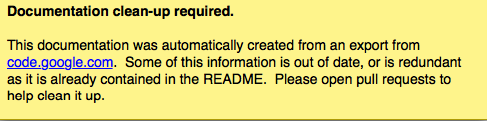

# Keymaps

If neither **--us-keymap** switch nor **--keymap** switch are used, then logkeys determines the keymap automatically with the help of **dumpkeys** command. For it to work even slightly reliably (mapping correct character), [console kernel keymap needs to be set](Documentation#Installation.md).

If you are using US layout keyboard and need default US keymap, run logkeys with **--us-keymap** switch.

## Existing keymaps

Some keymaps have been committed in this repo.  See the [keymaps directory](../keymaps).

Be aware that using the keymap that matches your keyboard layout doesn't necessarily mean that all keys are covered or that the characters match to those that you type in – the keymap used by your system (loaded by **loadkeys** command for console, and **setxkbmap** command for X) may be set completely arbitrarily. In most cases, though, these should work fine.

## Creating keymaps

You can easily create keymaps for your layout by taking one example
and then modifying it with the help of a keyboard layout tool (e.g.,
see the following [example layout tool from
Microsoft](http://msdn.microsoft.com/en-us/goglobal/bb964651.aspx)).
If you create a keymap, please upload it as a [new
issue](https://github.com/kernc/logkeys/issues).

## Format

The keymap file is expected to be UTF-8 encoded.

Each line of file represents either one character key or one function
key.  The format specifies at least two and up to three
space-delimited characters on character key lines (first character
without modifiers, second with Shift in action, optional third with
AltGr in action), and up to 7 characters long string on function key
lines.

For example, Slovene or Croatian keymap would look like this (line
numbers are added for convenience only):

```
  1: <Esc>
  2: 1 ! ~
  3: 2 " ˇ
  4: 3 # ^
  5: 4 $ ˘
  6: 5 % °
  7: 6 &amp; ˛
  8: 7 / `
  9: 8 ( ˙
 10: 9 ) ´
 11: 0 = ˝
 12: ' ? ¨
 13: + * ¸
 14: <BckSp>
 15: <Tab>
 16: q Q \
 17: w W |
 18: e E €
 19: r R
 20: t T
 21: z Z
 22: u U
 23: i I
 24: o O
 25: p P
 26: š Š ÷
 27: đ Đ ×
 28: <Enter>
 29: <LCtrl>
 30: a A
 31: s S
 32: d D
 33: f F [
 34: g G ]
 35: h H
 36: j J
 37: k K ł
 38: l L Ł
 39: č Č
 40: ć Ć ß
 41: ¸ ¨
 42: <LShft>
 43: ž Ž ¤
 44: y Y
 45: x X
 46: c C
 47: v V @
 48: b B {
 49: n N }
 50: m M §
 51: , ; <
 52: . : >
 53: - _
 54: <RShft>
 55: <KP*>
 56: <LAlt>
 57:
 58: <CpsLk>
 59: <F1>
 60: <F2>
 61: <F3>
 62: <F4>
 63: <F5>
 64: <F6>
 65: <F7>
 66: <F8>
 67: <F9>
 68: <F10>
 69: <NumLk>
 70: <ScrLk>
 71: <KP7>
 72: <KP8>
 73: <KP9>
 74: <KP->
 75: <KP4>
 76: <KP5>
 77: <KP6>
 78: <KP+>
 79: <KP1>
 80: <KP2>
 81: <KP3>
 82: <KP0>
 83: <KP.>
 84: < >
 85: <F11>
 86: <F12>
 87: <KPEnt>
 88: <RCtrl>
 89: <KP/>
 90: <SysRq>
 91: <AltGr>
 92: <Break>
 93: <Home>
 94: <Up>
 95: <PgUp>
 96: <Left>
 97: <Right>
 98: <End>
 99: <Down>
100: <PgDn>
101: <Ins>
102: <Del>
103: <Pause>
104: <LMeta>
105: <RMeta>
106: <Menu>
```

How does one know which lines belong to character keys and which lines to function keys?

Well, the easiest way is to use **--export-keymap**, and examine the exported keymap.
Make sure you export in a virtual terminal (Ctrl+Alt+Fn) and not in X as this way there is higher chance of more keys getting exported correctly (don't ask me why).

Basically, **--export-keymap** ouputs 106 lines for 106 keys, even if some of those keys
aren't located on your keyboard. Lines 1, 14, 15, 28, 29, 42, 54-83,  85-106  belong
to  function keys, all other lines (2-13, 16-27, 30-41, 43-53, 84) belong to character keys.

**Line 57 is reserved for Space** and it should always be ' '. Line 84 is reserved for
the  key  just  right  to  left Shift that is present on some international layouts.
Other lines can be quite reliably determined by looking at one exported keymap.  The
keys generally follow the order of their appearance on keyboard, top-to-bottom left-
to-right.
