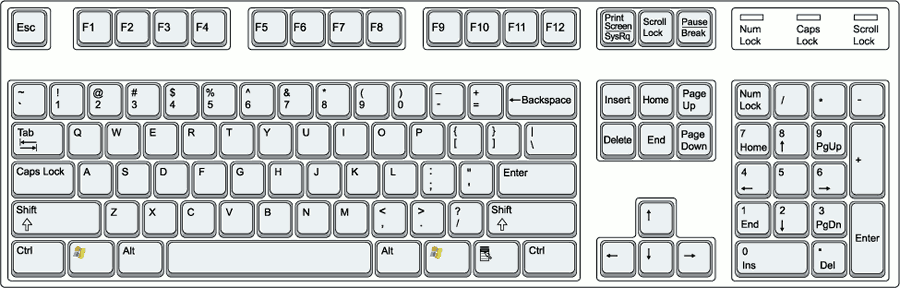

# logkeys Linux keylogger #

## Important announcement for Arch Linux users ##

logkeys was having an [issue on Arch Linux where it produced an empty
log](https://github.com/kernc/logkeys/issues/60). The issue
is now fixed in the repository (fix found by **bytbox** from the Arch
Linux community), so if you're on Arch (or you seem to experience this
issue), please check out the source from GitHub.

## NEWS: logkeys version 0.1.1a (alpha) released ##
  * fixed 100% CPU issue on x64
  * various bug fixes
  * removed pgrep dependency
  * PID file now in /var/run/
  * other symlink attack vulnerability fixes
  * other security fixes
  * code refactoring
  * remote log uploading via HTTP
  * lkl and lklk are now llk and llkk to avoid confusion
  * llk and llkk are now programs that run logkeys-start.sh/-stop.sh scripts
  * also recognize "HID" USB keyboard devices
  * bug fixes

---

### What is logkeys?

**logkeys is a linux keylogger** (GNU/Linux systems only).  It is no
more advanced than other available linux keyloggers, but is a bit more
up to date, it doesn't unreliably repeat keys and it should never
crash your X. All in all, it just seems to work. It relies on event
interface of the Linux input subsystem. Once set, it logs all common
character and function keys, while also being fully aware of Shift and
AltGr key modifiers. **It works with serial as well as USB
keyboards**.

### What is a keylogger?

Keylogger is a software that quietly monitors keyboard input so as to
log any keypresses the user makes. Keyloggers can be used by malicious
attackers to sniff out passwords and other sensitive textual
information, but often times the user himself (or the corporate
branch) wants to monitor his computer unattended (or the employees),
reliably storing any unauthorized keyboard activity for later
inspection. For example, when you leave your PC just to grab a quick
bite from the vending machine, you might want to know if anybody was
touching it while you were gone. Or you could use it to monitor your
supposedly cheating wife, or young kids while they are surfing the
web. You could also use it to obtain statistics of your most pressed
keys in order to create your custom Dvorak-style keyboard (I've seen
that done). Perhaps you want EVERYTHING you've typed or written in the
past months archived for ANY purpose... Uses are limitless.

### Are there alternative Linux keyloggers?

There is a plethora of keyloggers for Windows, but not so many for Linux.

On GNU/Linux systems and other reasonable operating systems,
keyloggers can be easily implemented with a few lines of shell
code. Novice users, however, are usually limited to a narrow set of
the following tools:

- [lkl](http://sourceforge.net/projects/lkl/)
- [uberkey](http://gnu.ethz.ch/linuks.mine.nu/uberkey/)
- [THC-vlogger](http://freeworld.thc.org/releases.php?q=vlogger), made
by a renowned group of hackers
- [PyKeylogger](http://pykeylogger.sourceforge.net/).

All these tools have their pros and cons:

- Lkl sometimes abnormally repeats keys and [its keymap configuration is rather
awkward](http://www.google.com/search?q=lkl+keymap) for a range of
users.
- Uberkey, which is just over a hundred lines of code, also often
repeats keys and [sometimes makes your mouse move
abruptly](http://www.google.com/search?q=uberkey+mouse+problem),
losing any sense of control.
- PyKeylogger is very feature rich, but only works in an X
environment.
- vlogger only logs shell sessions and currently the code does not
build (on Ubuntu 14.04 at least).

There may be other tools, but logkeys definitely makes a
simple and competitive addition.

### What keyboards logkeys does work with?

logkeys supports keyboards like on the image below (courtesy of
SEOConsultants.com). These are standard 101 to 105-key PC keyboards
with no Asian extensions.

logkeys should also work with serial as well as USB
keyboards, or similar "HID" devices.

